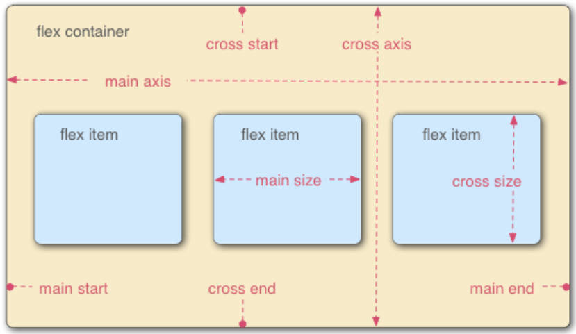
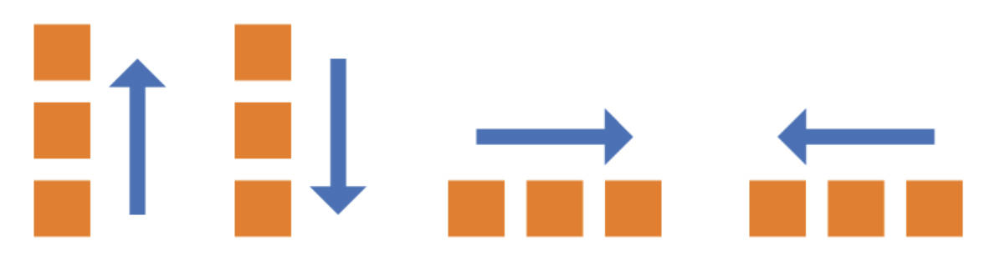
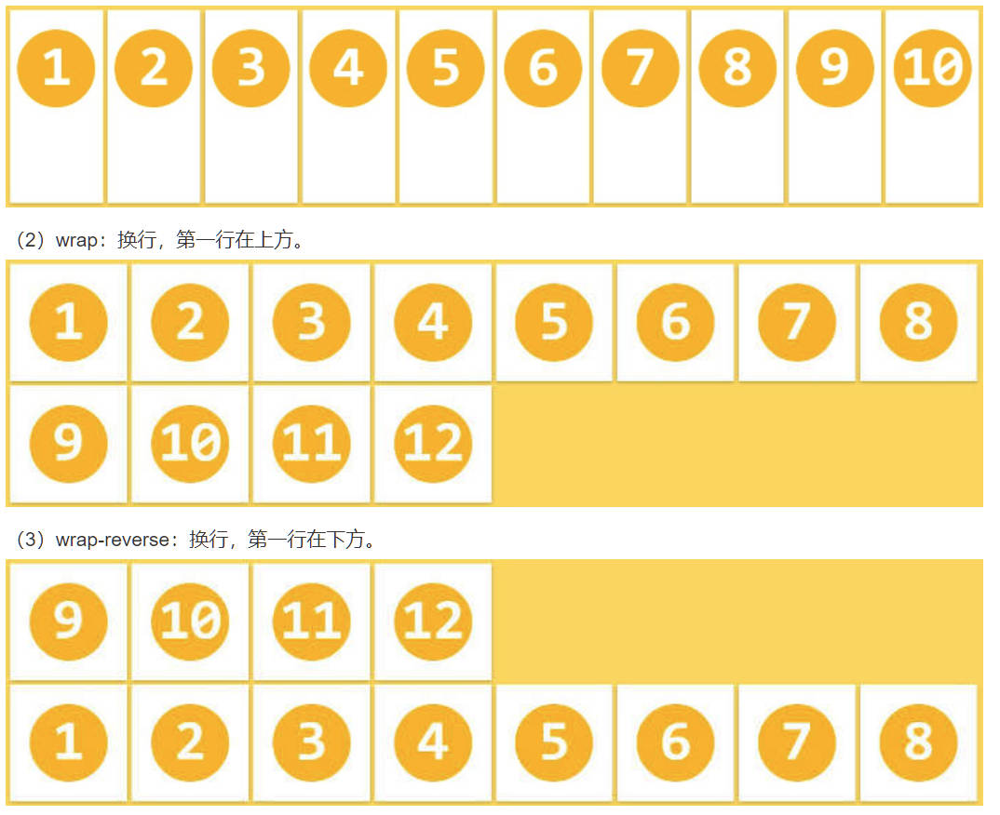
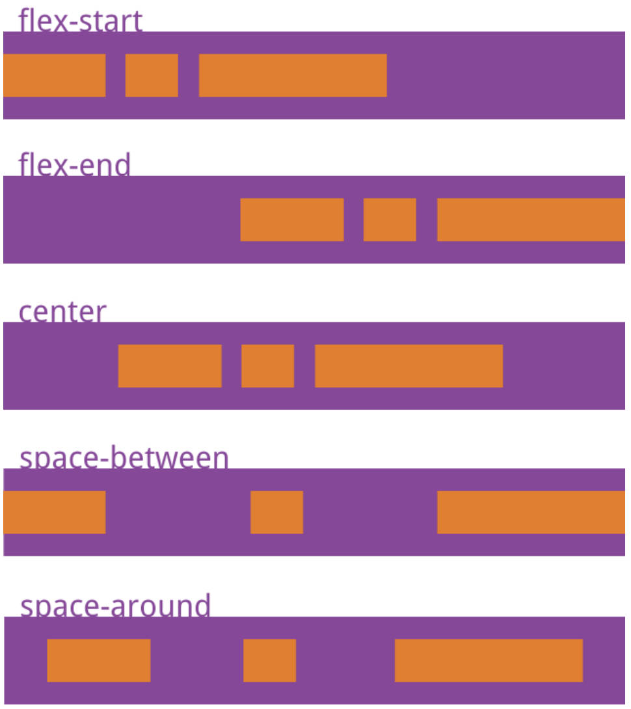
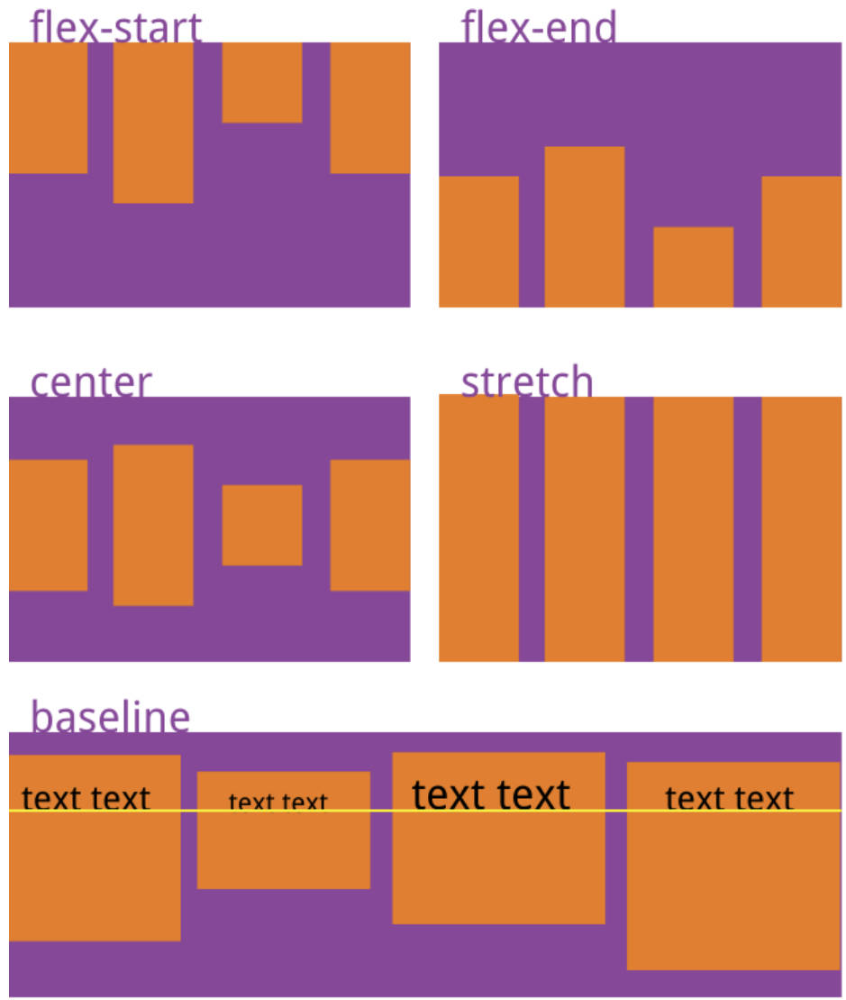
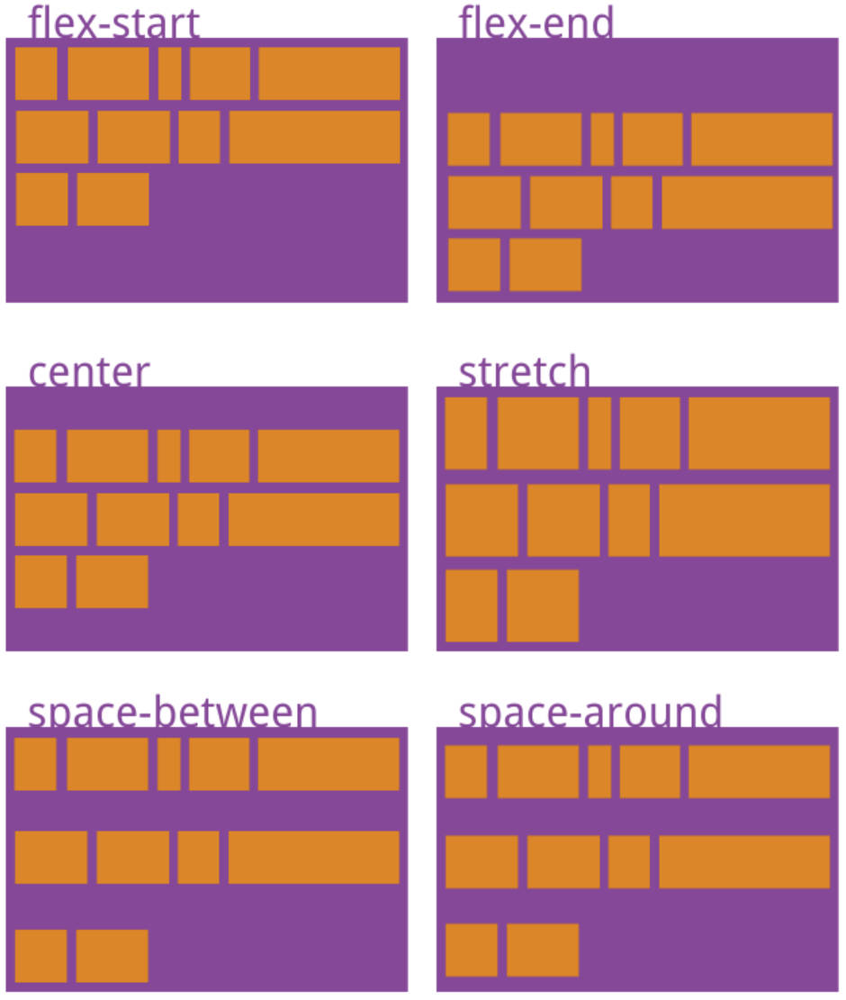
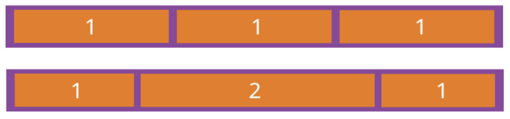
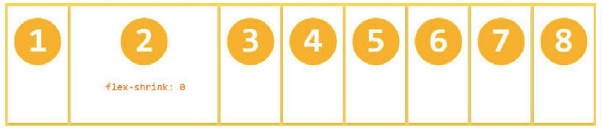
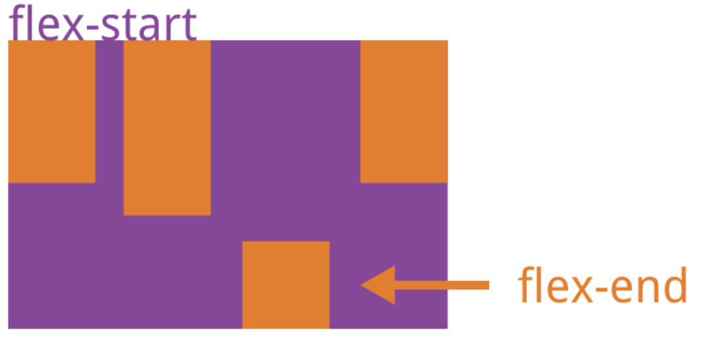

# Flex
## 概念

Flex是Flexible Box的缩写，意为”弹性布局”，用来为盒状模型提供最大的灵活性。
设为Flex布局以后，子元素的float、clear和vertical-align属性将失效。
采用Flex布局的元素，称为**Flex容器**（flex container），简称”容器”。它的所有子元素自动成为容器成员，称为**Flex项目**（flex item）。
容器默认存在两根轴：水平的**主轴**（main axis）和垂直的**交叉轴**（cross axis）。
主轴的开始位置（与边框的交叉点）叫做**main start**，结束位置叫做**main end**；
交叉轴的开始位置叫做**cross start**，结束位置叫做**cross end**。
项目默认沿主轴排列。单个项目占据的主轴空间叫做main size，占据的交叉轴空间叫做cross size。
## 容器属性
### flex-direction

决定主轴的方向（即项目排列方向）
```
.box {
flex-direction: row | row-reverse | column | column-reverse;
}
```
### flex-wrap

flex-wrap属性定义，如果一条轴线排不下，如何换行。
```
.box{
  flex-wrap: nowrap | wrap | wrap-reverse;
}
```
### flex-flow
flex-flow属性是flex-direction属性和flex-wrap属性的简写形式，默认值为row nowrap。
```
.box {
  flex-flow: <flex-direction> <flex-wrap>;
}
```
### justify-content

justify-content属性定义了项目在主轴上的对齐方式。
**flex-start**：靠左对齐
**flex-end**：靠右对齐
**center**：靠中心对齐
**space-between**：两端靠左右对齐，项目之间的间隔都相等。
**space-around**：每个项目两侧的间隔相等。所以，项目之间的间隔比项目与边框的间隔大一倍。
```
.box {
  justify-content: flex-start | flex-end | center | space-between | space-around;
}
```
### align-items

align-items属性定义项目在交叉轴上如何对齐。
**flex-start**：交叉轴的起点对齐。
**flex-end**：交叉轴的终点对齐。
**center**：交叉轴的中点对齐。
**baseline**: 项目的第一行文字的基线对齐。
**stretch（默认值）**：如果项目未设置高度或设为auto，将占满整个容器的高度。
```
.box {
  align-items: flex-start | flex-end | center | baseline | stretch;
}
```
### align-content

align-content属性定义了多根轴线的对齐方式。如果项目只有一根轴线，该属性不起作用。
**flex-start**：与交叉轴的起点对齐。
**flex-end**：与交叉轴的终点对齐。
**center**：与交叉轴的中点对齐。
**space-between**：与交叉轴两端对齐，轴线之间的间隔平均分布。
**space-around**：每根轴线两侧的间隔都相等。所以，轴线之间的间隔比轴线与边框的间隔大一倍。
**stretch（默认值）**：轴线占满整个交叉轴。
```
.box {
  align-content: flex-start | flex-end | center | space-between | space-around | stretch;
}
```
## 项目属性
### order
order属性定义项目的排列顺序。数值越小，排列越靠前，默认为0。
```
.item {
  order: <integer>;
}
```
### flex-grow

flex-grow属性定义项目的放大比例，默认为0，即如果存在剩余空间，也不放大。
```
.item {
  flex-grow: <number>; /* default 0 */
}
```
### flex-shrink

flex-shrink属性定义了项目的缩小比例，默认为1，即如果空间不足，该项目将缩小。
```
.item {
  flex-shrink: <number>; /* default 1 */
}
```
### flex-basis
flex-basis属性定义了在分配多余空间之前，项目占据的主轴空间（main size）。浏览器根据这个属性，计算主轴是否有多余空间。它的默认值为auto，即项目的本来大小。
```
.item {
  flex-basis: <length> | auto; /* default auto */
}
```
### flex
flex属性是flex-grow, flex-shrink 和 flex-basis的简写，默认值为0 1 auto。后两个属性可选。
```
.item {
  flex: none | [ <'flex-grow'> <'flex-shrink'>? || <'flex-basis'> ]
}
```
### align-self

align-self属性允许单个项目有与其他项目不一样的对齐方式，可覆盖align-items属性。默认值为auto，表示继承父元素的align-items属性，如果没有父元素，则等同于stretch。
```
.item {
  align-self: auto | flex-start | flex-end | center | baseline | stretch;
}
```